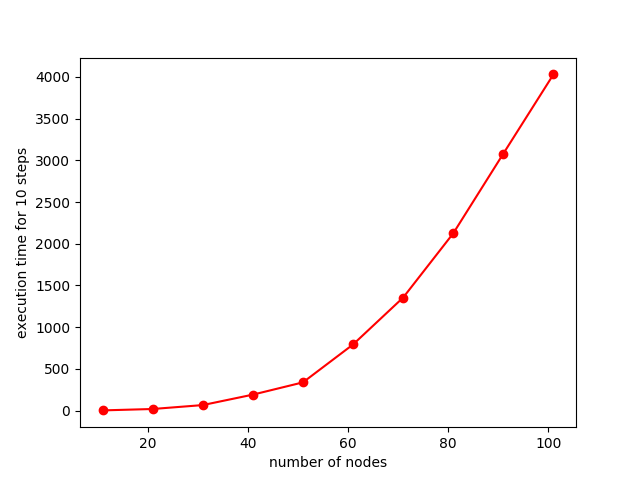
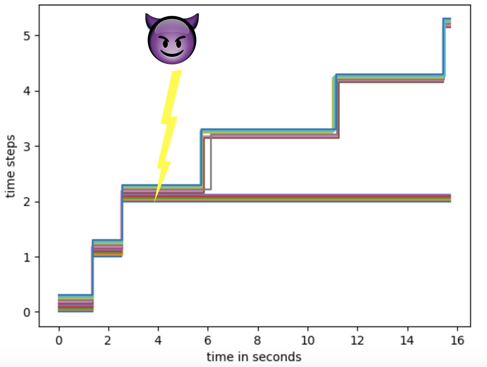
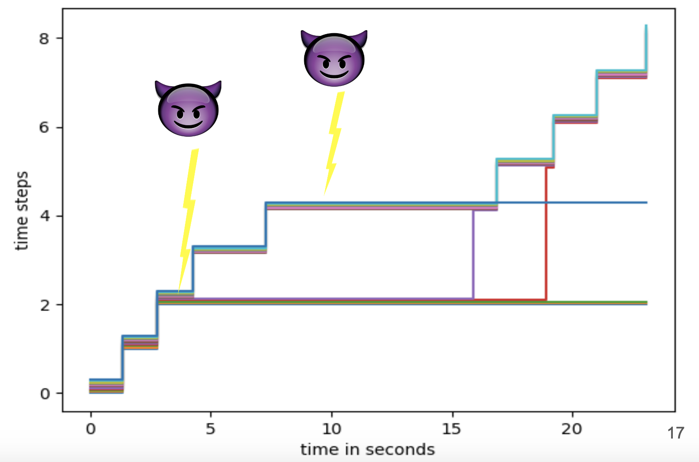
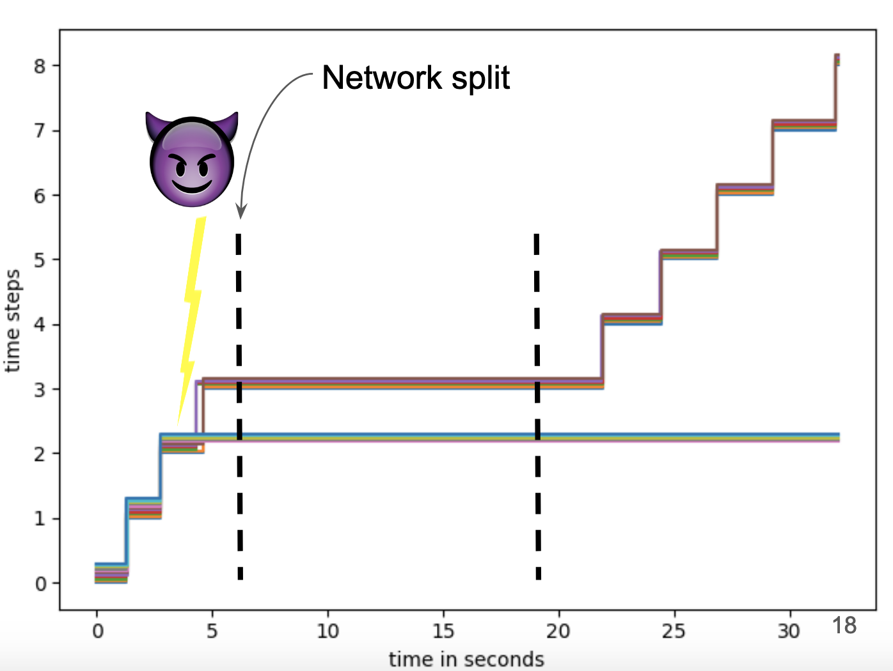

# Internship project report
link of the [presentation](https://docs.google.com/presentation/d/1RNHOncvFA8lxpKP2bQU5JFEXrFGsbp3lpjf-URfH3xQ/edit?usp=sharing).
## Table of Contents
1. [Introduction](#Introduction)
2. [TLC overview](#TLC-overview)
3. [Motivation](#Motivation)
4. [Implementations](#Implementations)
5. [Evaluation](#Evaluation)
6. [Adversarial scenarios](#Adversarial-scenarios)
7. [Conclusion](#Conclusion)

## Introduction
Threshold logical clocks (TLC) is a protocol for making virtual synchrony on top of asynchronous networks. It can be used as an abstraction layer for implementing synchronous protocols without assuming any synchrony in the underlying network layer.  Since it is supposed to work in asynchronous networks, It should tolerate high delays in the transport layer. 

The main purpose of this project is to test TLC with various transport layer implementations and test its performance under different delay characteristics. Also, It is interesting to see how TLC behaves under different adversarial scenarios, so some adversarial behaviors are simulated in this project. 

## TLC overview
TLC is an abstract layer for synchronization, which synthesizes a virtual notion of time on an asynchronous network. In TLC every node keeps its own clock and increments it in lock-step with a group of nodes. There are 2 key ideas behind TLC:
* Nodes progress in groups, collectively.
* Each node needs to receive a threshold number of messages to advance to the next time step.

Using TLC makes a "virtual synchrony", which can be used by higher levels. So higher-level protocol never need to worry about asynchrony in underlying layers.

### TLC rounds
In each TLC round:
1. Every node broadcasts a message and waits for acknowledgments
2. Upon receiving a message, each node acknowledges that message
3. Once a node collects tw number of acks, it considers the message to be **threshold witnessed**
4. A node will increase its time step, once it receives tm number of threshold witnessed messages

A particular protocol instance TLC(tm, tw, n) is parameterized by message threshold tm, witness threshold tw, and number of nodes n.

## Motivation
We are trying to test different properties of TLC using different transport layers, making sure it behaves in a way it is supposed to. Since TLC is expected to work in asynchronous settings, we should test its tolerance to delays imposed by the network layer. So our first goal is to test TLC with different transport layers and with different delay characteristics.

Then we must make sure that the protocol behaves well in the presence of a network adversary. So, we have to investigate TLC's resilience to adversaries within our thread model. We may violate our thread model to make sure that we can not make progress. 

## Implementations
There are 2 main implementations for TLC. The first one is based on libp2p and the second one is based on mail protocols. Each implementation has its challenges and characteristics, and it is covered in the following sections.

### libp2p based implementation
#### Introduction to libp2p
Libp2p is a modular network stack, first introduced in the IPFS project but now it has been completely separated and is maintained independently. It has been developed with interoperability in mind to make p2p communication and also developing p2p applications more straightforward.  

A good feature of libp2p is its modular design where developers can plug different transport layer implementation and even implement their layer using provided interfaces and extend it for their needs. Also, It is possible to use multiple routing protocols, peer discovery methods, etc. 

Currently, libp2p is implemented in 3 languages: Go, Rust and Javascript.

The rationale behind choosing libp2p is that it is easy to use. Testing an implementation with several transport layers can be done simply by plugging different transport modules. Also, there are some implementations of intricate protocols, so there is no need to implement everything and existing implementations can be used.

#### Implementation details
Publish-Subscribe(PubSub) pattern is used for message broadcasts. In PubSub, message senders, called *publishers*, do not program the message to be sent directly to the receivers, called *subscribers*, instead they classify messages into topics. Likewise, subscribers express interest in one or more topics and receive messages published in those topics. 

Since PubSub is a good pattern for broadcasting a message, It has been chosen as the broadcasting pattern. Also, there is an implementation of Pubsub available for libp2p which uses gossiping for broadcast and can be used without too much effort.

For the transport layer, 3 different protocols have been used. 
* TCP
*  QUIC, a protocol designed by Google with the overall goal of reducing latency comparing to TCP.  It employs UDP as its basis, but flow control and loss recovery are performed at the QUIC level. 
* Websocket, to investigate it and also verify that it works correctly. WebSocket enables interaction between web browsers and libp2p with lower overhead comparing to HTTP.

#### Challenges
There are some challenges using libp2p. The main challenge is that the documentation for the project is really poor. There are no API docs, There are only a few simple examples, and most documentation pages are left blank.

Moreover, some implementations are still work-in-progress, so there are some bugs in these implementations. for example, there is a bug in PubSub implementation which caused message loss in some circumstances. After increasing the number of nodes, suddenly messages started to get lost. We opened an issue for the bug in the Github and it has not been resolved yet. 

For circumventing the stated problem 2 courses of action had been taken:
1. Introducing a random delay before sending out messages. This approach was successful for some number of nodes but it failed when the number started to grow. Even adding a delay in the order of 10 seconds could not make it work.
2. Utilizing lower layer functions and placing a channel to handle message receptions, Instead of using the default function. The default function for receiving messages had a buffer with a length of 32, which was not enough for managing message reception. The problem vanished by implementing a custom message handler, using lower layer functions, and it was feasible to simulate with more nodes.
---
### E-mail-based implementation
E-mail protocols have been used for the second main implementation. E-mail has been chosen because it has a high delay so we could test TLC in high-delay environments. SMTP is used for sending e-mails and IMAP used for receiving e-mails.

SMTP and IMAP are 2 of the main protocols used for sending and receiving e-mails. There are some client-side implementations of these protocols available in Go, So we have used these protocols for our implementation.

An e-mail server has been set up in a virtual machine, and it was not powerful. The server introduced some delays to our simulations because it could not deliver messages quickly. Since the goal was to test TLC's delay tolerance, the delay caused by the server was not a major problem.

## Evaluation
In this section, we discuss the evaluation of our implementations. The main question we want to answer is whether TLC can be used in practical situations with different transport layers. In particular, we want to make sure that it behaves properly in high-delay environments.

We implemented TLC in Go. All experiments were run on a MacBookPro 2017 having a 2.5 GHz Intel Core i7 CPU and 16 GB of RAM.

### Evaluating libp2p-based implementation
In this section, we discuss the evaluation of our implementations. The main question we want to answer is whether TLC can be used in practical situations with different transport layers. First, we want to look at the effect of different transport layers on TLC round lengths. Then we want to show that the safety and liveness properties hold under the assumed threat model. Additionally, we want to show that when the threat model is violated, only the liveness is affected.

The network topology is a simple arrangement in which every node is only connected to 4 subsequent nodes in a ring. Every node can publish a message and it will be gossiped to reach all nodes, despite nodes not being directly connected.

We have measured the time it takes for nodes to reach timestep 10 and the result can be seen on the graph.

  

We can see that the round lengths are a polynomial function of the number of nodes. An increase in the number of nodes causes messages and acknowledgments to pile up, making rounds take longer to complete.

### Evaluating different transport modules of libp2p
For this experiment, we have used TCP, QUIC, and WebSocket as the transport modules of libp2p. We have run the experiment using 11 nodes for 10 timesteps, with thresholds equal to 6. The result can be seen in the table.

Transpor Layer | TCP | QUIC | WebSocket
--- | --- | --- | --- 
Time for 10 rounds (s) | 2.99 | 5.06 | 3.70

Unexpectedly, QUIC-based implementation is slower than the others. Also, It can be seen that in all implementation, it takes less than half of a second for a round to be completed.

### Evaluating e-mail-based implementation
For this experiment, we have set up an e-mail server and implemented the client-side in Go. For the client-side, we have used gomail for sending e-mails through SMTP, and go-imap for receiving e-mails using IMAP protocol. For the server-side, we have installed iRedMail on a virtual Linux machine, using VirtualBox on the same MacBook. iRedMail uses Postfix for handling SMTP requests and Dovecot for IMAP.

It is worth mentioning that messages are encoded using Protobuf and sent in the subject field of e-mails, in order to prevent problems caused by UTF-8 encoding of e-mail body in the SMTP protocol. 

The simulation has been done by using 5 nodes, for 10 timesteps. It took  293 seconds for them to reach to timestep 10.

## Adversarial scenarios
First, the threat model must be specified for adversarial test cases. In the TLC threat model, an adversary can choose any set Sd of up to f nodes, whose messages may be delayed indefinitely (n=2f+1).  Also, the adversary can dynamically alter the indefinite-delay set but has to deliver all in-flight messages to the nodes leaving the set.

3 different kinds of attacks have been simulated on existing implementations: *Minority attack* , *Threat model violating attack*, and *Minority attacks during network split*.

Only the TCP version of libp2p-based implementation has been used for these simulations, but other implementations potentially can be used.

### Minority attack
In this attack, the adversary attacks a minority number of nodes and keeps them in Sd set. Healthy nodes expected to make progress, since they are still a majority. 

For simulating this attack, we have used 11 nodes with the majority threshold and tried to simulate for 10 timesteps. First, we start with all nodes in a good state. After 4 seconds, the attacker isolates 5 nodes and prevents them from receiving and sending messages. Since these nodes can not receive any messages, they get stuck, but the other 6 nodes continue to make progress.

  

### Violating the threat model
In this attack, the attack is performed on more than the threshold number of nodes. Since we are violating the threat model, we expect nodes to halt under this attack.

The number of nodes is the same as the previous attack. We start with all nodes in a healthy state, then the attacker tries to attack 5 nodes without violating the threat model. Healthy nodes continue to make progress. After some seconds, the attacker adds another node to the Sd group, making healthy nodes less than the threshold, so they can not make progress. After some seconds a node (shown in purple) is removed from the Sd set and then it catches up with other nodes. rejoining nodes will immediately start making progress, after receiving in-flight messages.

  

### Minority attack during a network split
In this case, a sudden network split has been simulated while some nodes are under attack. For this execution, we have delayed some messages between 2 groups of nodes for a limited time, while a minority of nodes are also under attack from an adversary.

For simulating this attack, we have simulated TLC(11,6,6), starting with all nodes in the healthy set. After 4 seconds, 5 nodes have been attacked by the attacker, but others continue making progress. Afterward, a problem in the network introduces high delays in the delivery of messages. The network split causes healthy nodes to be divided into 2 groups of 3 nodes. Later, the split ceases and on-flight messages get delivered to the nodes, causing them to make progress.

  

## Conclusion
We showed that TLC can tolerate high delays in the transport layer. We also tested the good behavior of TLC under different attacks within the assumed threat model. We confirmed that even violating the threat model can not affect the safety of TLC.
